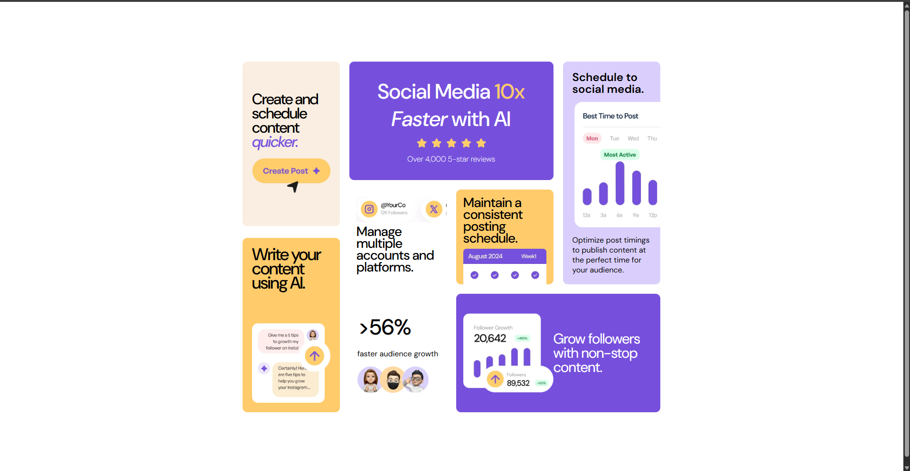

# Frontend Mentor - Bento grid solution

Esta é uma solução para o [Bento grid challenge on Frontend Mentor](https://www.frontendmentor.io/challenges/bento-grid-RMydElrlOj). Os desafios do Frontend Mentor ajudam você a aprimorar suas habilidades de codificação construindo projetos realistas. 

## Table of contents

- [Overview](#overview)
  - [The challenge](#the-challenge)
  - [Screenshot](#screenshot)
  - [Links](#links)
- [My process](#my-process)
  - [Built with](#built-with)
  - [Continued development](#continued-development)
- [Author](#author)

## Overview

### The challenge

Os usuários devem ser capazes de:

- Visualizar o layout ideal para a interface dependendo do tamanho da tela do dispositivo.

### Screenshot

### Links

- Live Site URL: [Add live site URL here](https://toalvs.github.io/bento-grid-main/)

## My process

### Built with

- Marcação semântica HTML5
- Propriedades personalizadas do CSS
- Flexbox
- CSS Grid
- Fluxo de trabalho Mobile-first

### Continued development

Estou realizando projetos para aprimorar a minha capacidade de usar os sistemas de layout grid e flexbox. Nesse projeto eu aprendi mais sobre como utilizar o grid. Mas ainda preciso melhorar a responsividade, ainda tenho dificuldade nesse quesito, consigo fazer mas não da forma que gostaria.

## Author

- Frontend Mentor - [@yourusername](https://www.frontendmentor.io/profile/ToAlvs)
